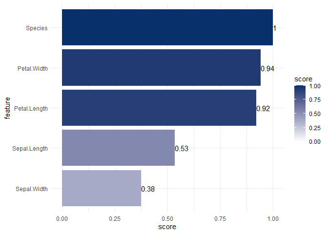
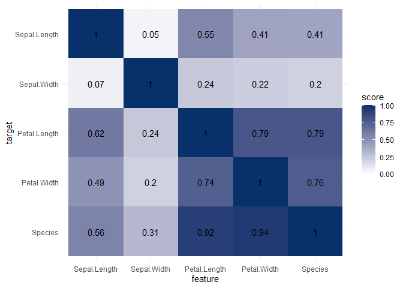
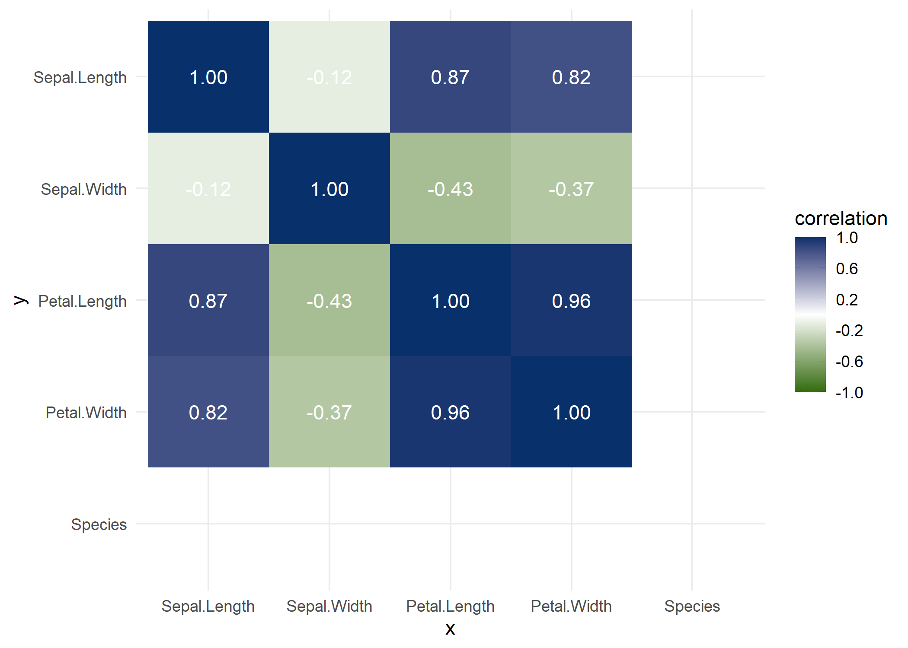
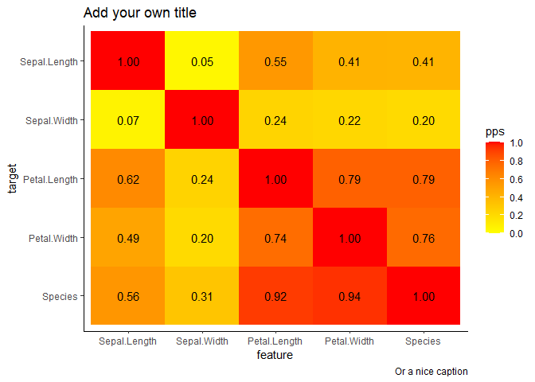

<!-- README.md is generated from README.Rmd. Please edit that file -->

<!-- badges: start -->

[](https://github.com/paulvanderlaken/ppsr/actions)
<!-- badges: end -->

# `ppsr` - Predictive Power Score

`ppsr` is the R implementation of [8080labs Predictive Power
Score](https://github.com/8080labs/ppscore).

The Predictive Power Score is an asymmetric, data-type-agnostic score
that can detect linear or non-linear relationships between two columns.
The score ranges from 0 (no predictive power) to 1 (perfect predictive
power). It can be used as an alternative to the correlation (matrix).

Read more about the (dis)advantages of the Predictive Power Score in
[this blog
post](https://towardsdatascience.com/rip-correlation-introducing-the-predictive-power-score-3d90808b9598).

## Installation

You can install the development version of `ppsr` using the following R
code:

``` r
# You can get the development version from GitHub:
# install.packages('devtools')
devtools::install_github('https://github.com/paulvanderlaken/ppsr')
```

## Computing PPS

You can think of the predictive power score as a framework for a family
of scores. There is not one single best way to calculate a predictive
power score. In fact, there are many possible ways to calculate a PPS
that satisfy the definition mentioned before.

Currently, the `ppsr` package calculates PPS by default:

  - Using the default decision tree implementation of the `rpart`
    package, wrapped by `parsnip`
  - Using 5 cross-validations
  - Using F1 scores to evaluate classification models. Scores are
    normalized relatively to a naive benchmark consisting of predicting
    the modal or random `y` classes
  - Using MAE to evaluate regression models. Scores are normalized using
    relatively to a naive benchmark of predicting the mean `y` value

## Usage

The `ppsr` package has three main functions that compute PPS:

  - `score()` - which computes an x-y PPS
  - `score_predictors()` - which computes all X-y PPS
  - `score_df()` - which computes all X-Y PPS
  - `score_matrix()` - which computes all X-Y PPS, and shows them in a
    matrix

where `x` and `y` represent an individual feature/target, and `X` and
`Y` represent all features/targets in a given dataset.

Examples:

``` r
ppsr::score(iris, x = 'Sepal.Length', y = 'Sepal.Width')
#> $x
#> [1] "Sepal.Length"
#> 
#> $y
#> [1] "Sepal.Width"
#> 
#> $result_type
#> [1] "predictive power score"
#> 
#> $pps
#> [1] 0.06790301
#> 
#> $metric
#> [1] "MAE"
#> 
#> $baseline_score
#> [1] 0.3372222
#> 
#> $model_score
#> [1] 0.3184796
#> 
#> $cv_folds
#> [1] 5
#> 
#> $seed
#> [1] 1
#> 
#> $algorithm
#> [1] "tree"
#> 
#> $model_type
#> [1] "regression"
```

``` r
ppsr::score_predictors(df = iris, y = 'Species')
#>              x       y                       result_type       pps      metric
#> 1 Sepal.Length Species            predictive power score 0.5591864 F1_weighted
#> 2  Sepal.Width Species            predictive power score 0.3134401 F1_weighted
#> 3 Petal.Length Species            predictive power score 0.9167580 F1_weighted
#> 4  Petal.Width Species            predictive power score 0.9398532 F1_weighted
#> 5      Species Species predictor and target are the same 1.0000000        <NA>
#>   baseline_score model_score cv_folds seed algorithm     model_type
#> 1      0.3176487   0.7028029        5    1      tree classification
#> 2      0.3176487   0.5377587        5    1      tree classification
#> 3      0.3176487   0.9404972        5    1      tree classification
#> 4      0.3176487   0.9599148        5    1      tree classification
#> 5             NA          NA       NA   NA      <NA>           <NA>
```

``` r
ppsr::score_matrix(df = iris)
#>              Sepal.Length Sepal.Width Petal.Length Petal.Width   Species
#> Sepal.Length   1.00000000  0.04632352    0.5491398   0.4127668 0.4075487
#> Sepal.Width    0.06790301  1.00000000    0.2376991   0.2174659 0.2012876
#> Petal.Length   0.61608360  0.24263851    1.0000000   0.7917512 0.7904907
#> Petal.Width    0.48735314  0.20124105    0.7437845   1.0000000 0.7561113
#> Species        0.55918638  0.31344008    0.9167580   0.9398532 1.0000000
```

## Visualizing PPS

Subsequently, there are three main functions that wrap around these
computational functions to help you visualize your PPS using `ggplot2`:

  - `visualize_pps()` - producing a barplot of all X-y PPS, or a heatmap
    of all X-Y PPS
  - `visualize_correlations()` - producing a heatmap of all X-Y
    correlations
  - `visualize_both()` - produces two heatmaps of the PPS and
    correlations of all X-Y PPS side-by-side

Examples:

``` r
# If you specify the target variable (y), you get a barplot of its predictors
ppsr::visualize_pps(df = iris, y = 'Species')
```

<!-- -->

``` r
# If you do not specify `y`, you get a PPS matrix visualized as a heatmap 
ppsr::visualize_pps(df = iris)
```

<!-- -->

``` r
ppsr::visualize_correlations(df = iris)
```

<!-- -->

``` r
ppsr::visualize_both(df = iris)
#> TableGrob (1 x 2) "arrange": 2 grobs
#>   z     cells    name           grob
#> 1 1 (1-1,1-1) arrange gtable[layout]
#> 2 2 (1-1,2-2) arrange gtable[layout]
```

You can change the colors of the visualizations using the functions
arguments. There are also arguments to change the color of the text
scores.

Furthermore, the functions return `ggplot2` objects, so you can easily
change the theme and other settings.

``` r
ppsr::visualize_pps(df = iris,
                    color_value_high = 'red', 
                    color_value_low = 'yellow',
                    color_text = 'black') +
  ggplot2::theme_classic() +
  ggplot2::labs(title = 'Add your own title', caption = 'Or a nice caption')
```

<!-- -->

## Open issues & development

PPS is a relatively young concept, and likewise the `ppsr` package is
still under development. If you spot any bugs or potential improvements,
please raise an issue or submit a pull request.

On the developmental agenda are currently:

  - Implementation of different modeling techniques / algorithms
  - Implementation of different model evaluation metrics
  - Implementation of downsampling for large datasets

Note that there’s also an unfinished [R implementation of the PPS
package by 8080labs](https://github.com/8080labs/ppscoreR).
